<!--
Reusable gallery template: wrap any set of images in a `.art-gallery` div,
one `.art-item` figure per image. Update data-title / data-medium / data-year
for each piece — those are the fields shown in the click-to-expand view.
Lays out as a 4-column grid (wraps responsively on smaller screens).

::: {.art-gallery}
<figure class="art-item" data-title="Piece Title" data-medium="Medium" data-year="Year">
  
</figure>
:::
-->

## Jenga Series

<div class="art-gallery">
  <figure class="art-item" data-title="Jenga Composition No.&nbsp;1" data-medium="Graphite on paper" data-year="2015">
    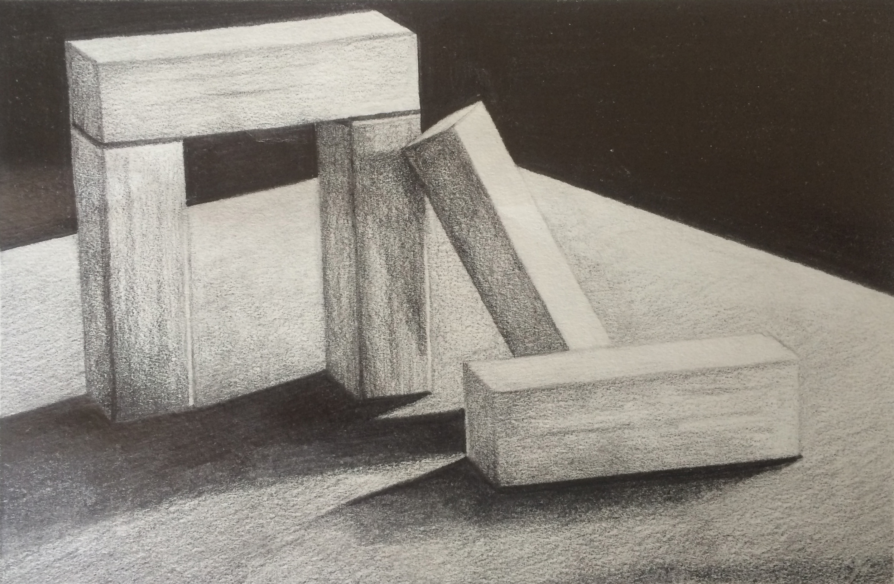
  </figure>

  <figure class="art-item" data-title="Jenga Composition No.&nbsp;2" data-medium="Graphite on paper" data-year="2015">
    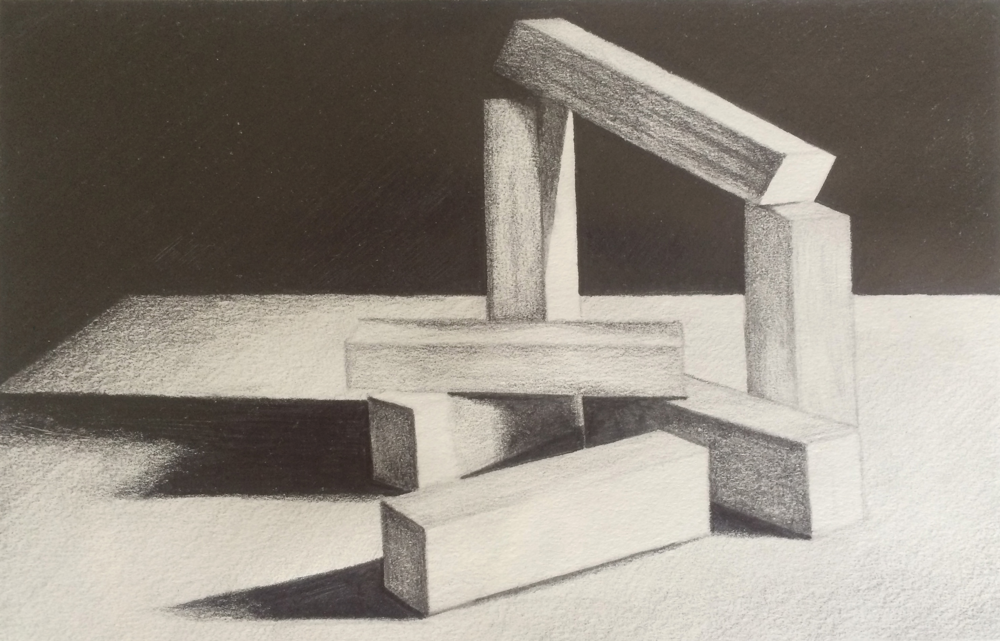
  </figure>

  <figure class="art-item" data-title="Jenga Composition No.&nbsp;3" data-medium="Graphite on paper" data-year="2015">
    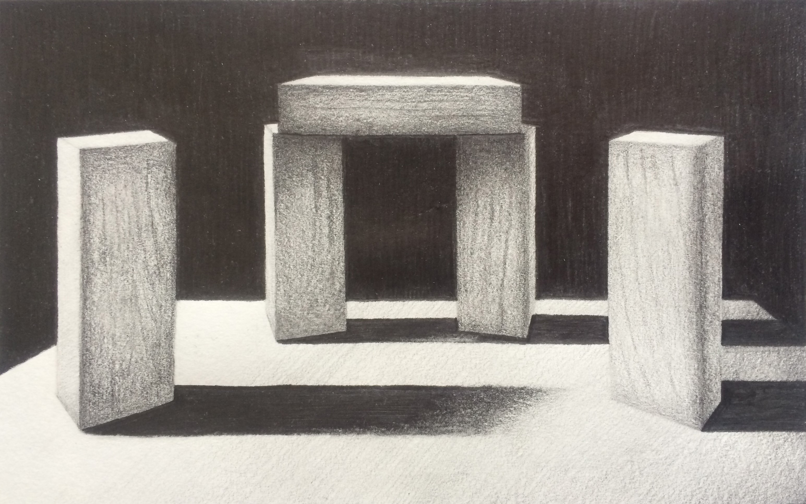
  </figure>

  <figure class="art-item" data-title="Jenga Composition No.&nbsp;4" data-medium="Graphite on paper" data-year="2015">
    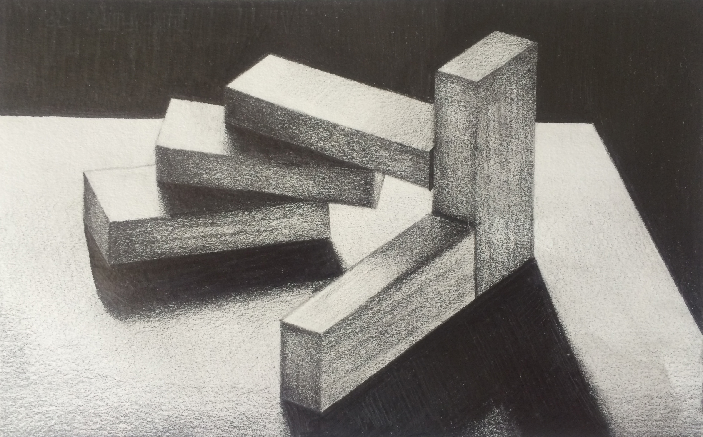
  </figure>

  <figure class="art-item" data-title="Jenga Composition No.&nbsp;5" data-medium="Graphite on paper" data-year="2015">
    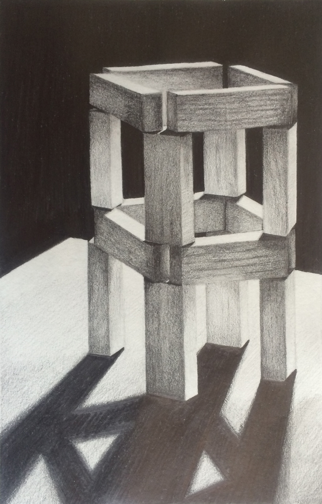
  </figure>

  <figure class="art-item" data-title="Jenga Composition No.&nbsp;6" data-medium="Graphite on paper" data-year="2015">
    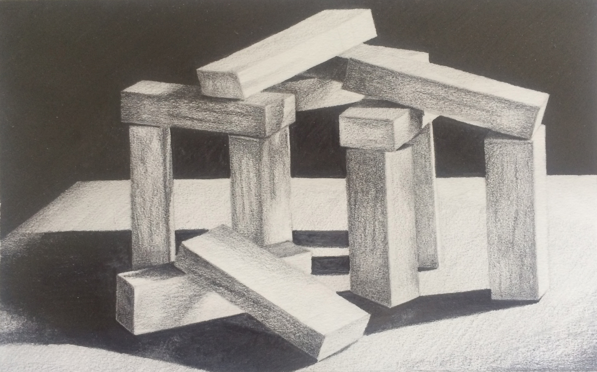
  </figure>

  <figure class="art-item" data-title="Jenga Composition No.&nbsp;7" data-medium="Graphite on paper" data-year="2015">
    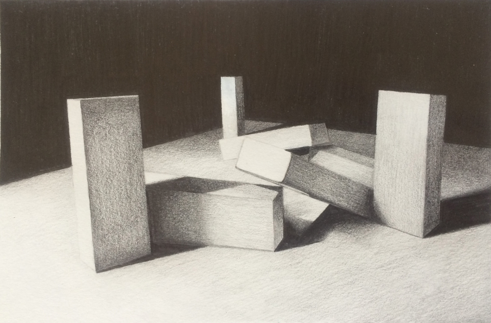
  </figure>

  <figure class="art-item" data-title="Jenga Composition No.&nbsp;8" data-medium="Graphite on paper" data-year="2015">
    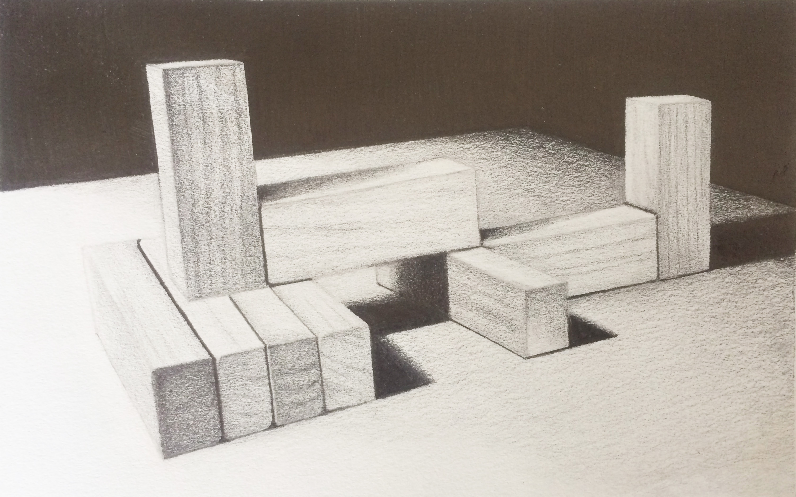
  </figure>

  <figure class="art-item" data-title="Jenga Composition No.&nbsp;9" data-medium="Graphite on paper" data-year="2015">
    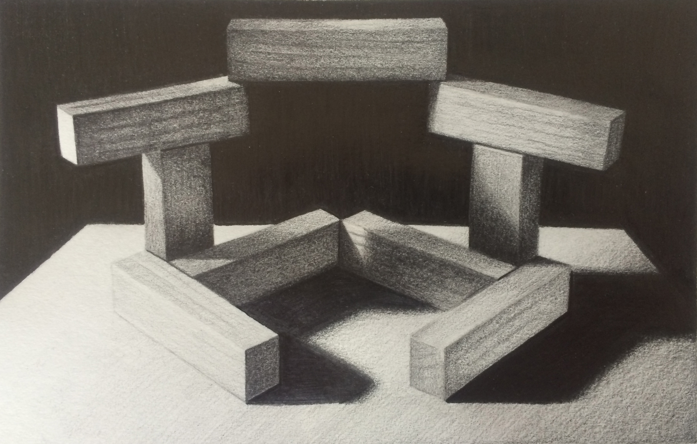
  </figure>

  <figure class="art-item" data-title="Jenga Composition No.&nbsp;10" data-medium="Graphite on paper" data-year="2015">
    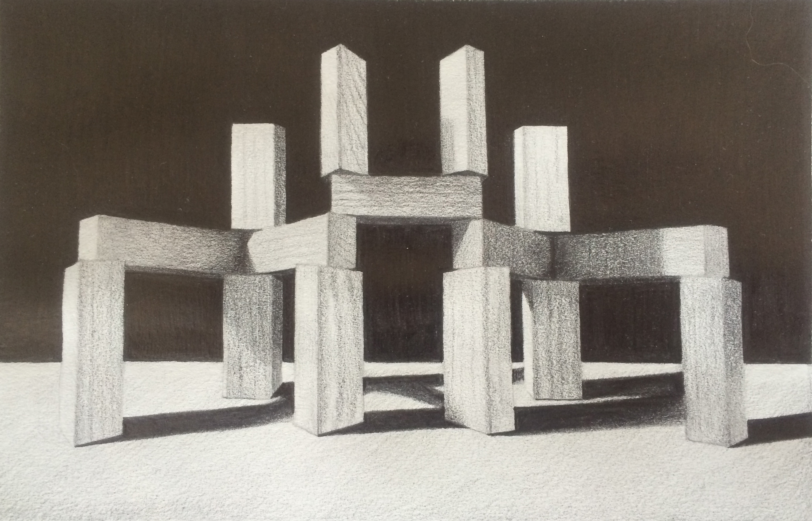
  </figure>

  <figure class="art-item" data-title="Jenga Composition No.&nbsp;11" data-medium="Watercolor" data-year="2015">
    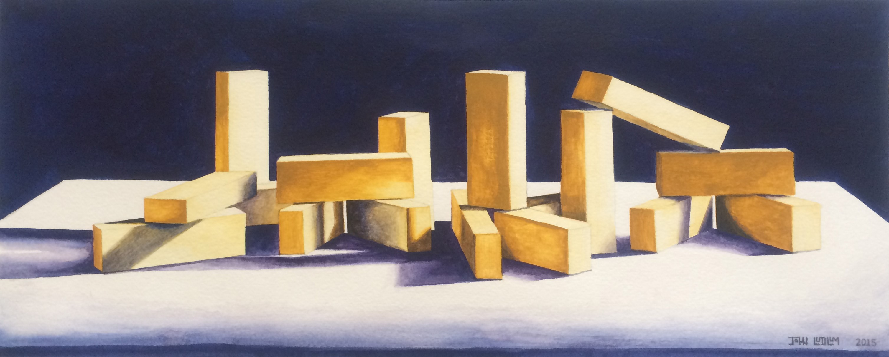
  </figure>

  <figure class="art-item" data-title="Jenga Composition No.&nbsp;12" data-medium="Watercolor" data-year="2015">
    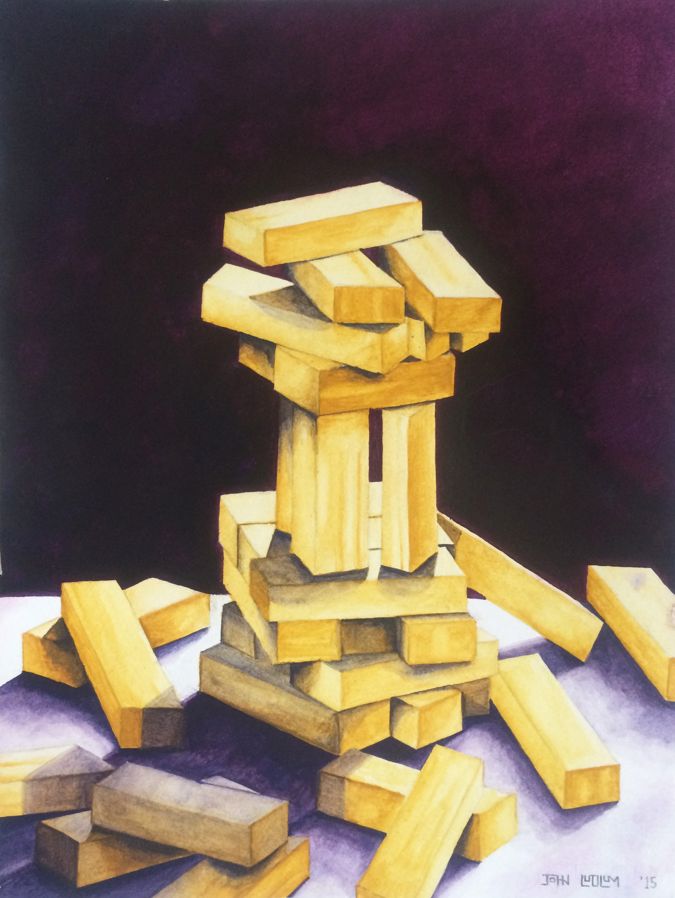
  </figure>
</div>

## Solo Works

<div class="art-gallery">

  <figure class="art-item" data-title="Clint Eastwood" data-medium="Graphite on paper" data-year="2014">
    
  </figure>

  <figure class="art-item" data-title="Donuts" data-medium="Oil pastel and graphite on paper" data-year="2014">
    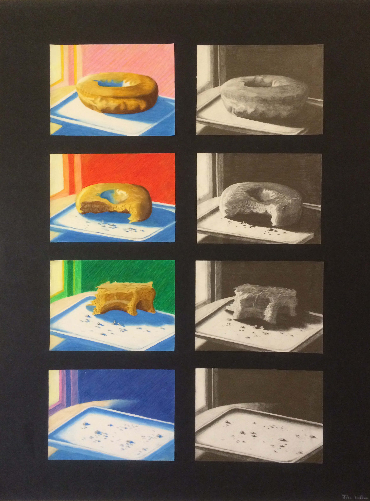
  </figure>

  <figure class="art-item" data-title="Gatorade Still Life" data-medium="Oil pastel on paper" data-year="2014">
    
  </figure>

  <figure class="art-item" data-title="Skull Still Life" data-medium="Charcoal on paper" data-year="2014">
    
  </figure>

  <figure class="art-item" data-title="Utah State Capitol Building" data-medium="Charcoal on paper" data-year="2014">
    
  </figure>

  <figure class="art-item" data-title="Venus of Urbino Study" data-medium="Graphite on paper" data-year="2014">
    
  </figure>

</div>

```{=html}
<script src="art-gallery.js"></script>
```
